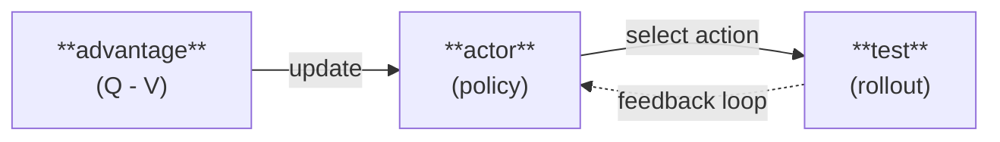
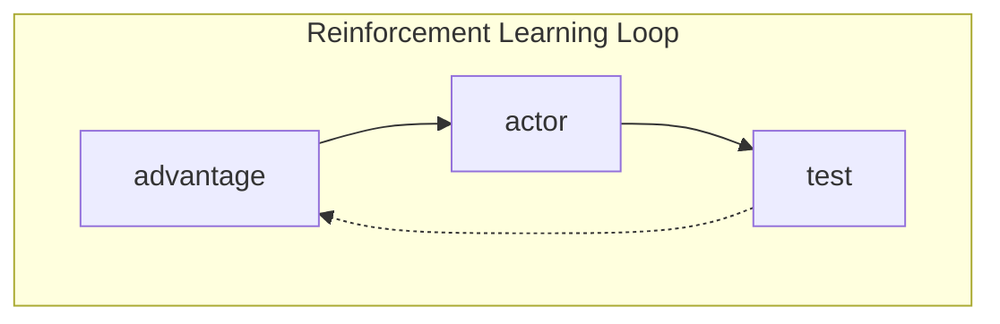

```mermaid
flowchart LR
    adv["**advantage**\n(Q - V)"]
    act["**actor**\n(policy)"]
    tst["**test**\n(rollout)"]

    adv -->|"update"| act
    act -->|"select action"| tst
    tst -.->|"feedback loop"| act
```

```mermaid
flowchart TB
    subgraph RL["Reinforcement Learning Loop"]
        adv["advantage"]
        act["actor"]
        tst["test"]

        adv --> act
        act --> tst
        tst -.-> adv
    end
```
